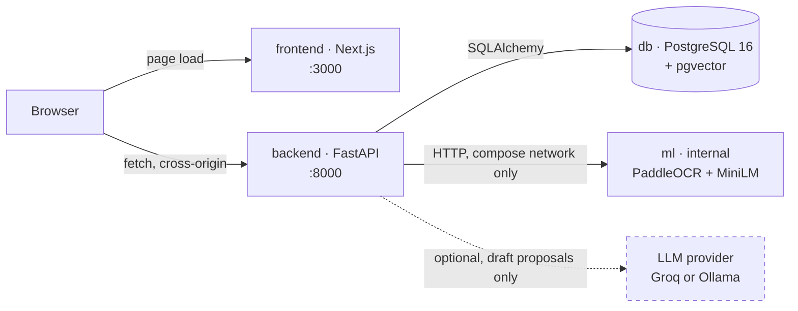
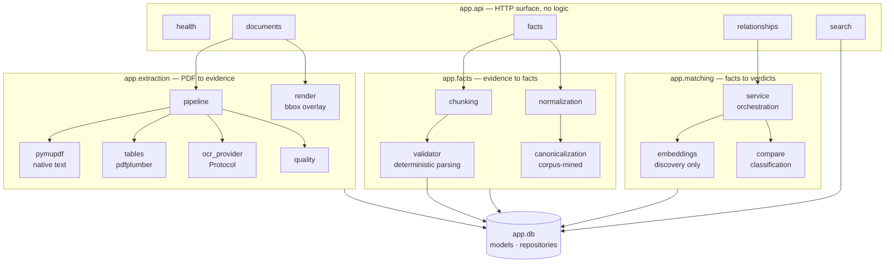
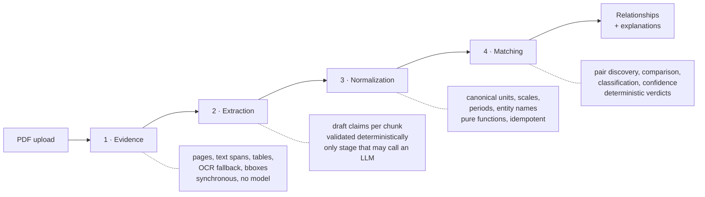
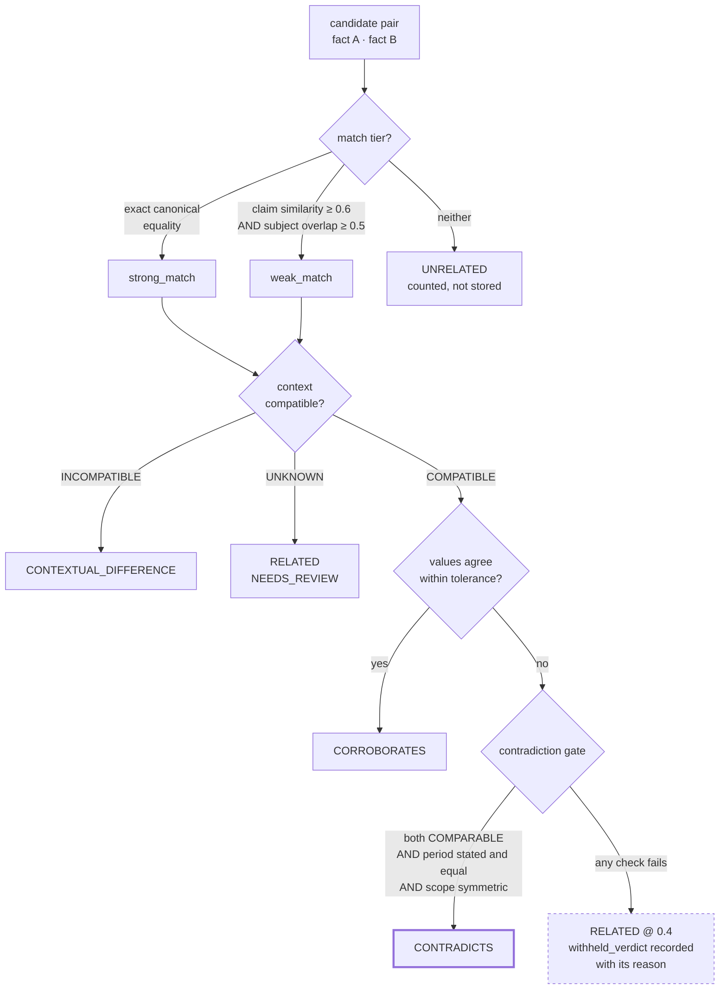
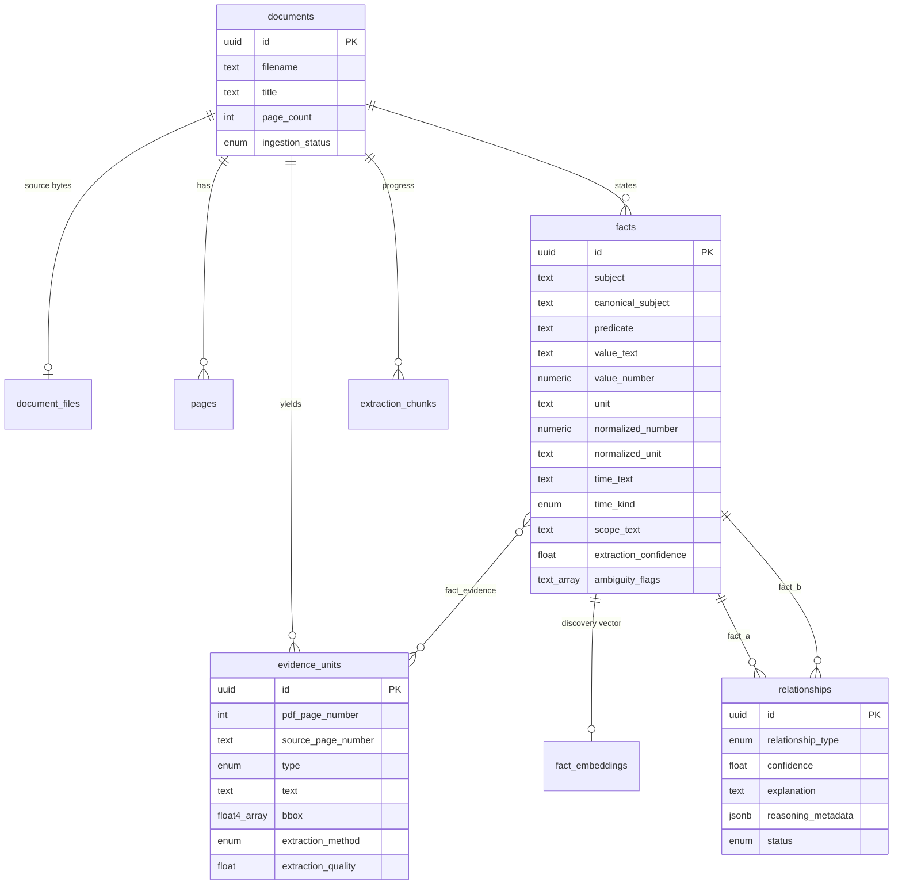

# Aletheia

A provenance-first fact knowledge layer. Aletheia reads PDFs, extracts the
quantitative claims inside them, normalizes those claims into a form that can
actually be compared, and then reconciles them against each other — telling you
when two documents agree, when they genuinely conflict, and when they merely
describe different things in similar words. Every fact it stores points back to
the page, the text span, and the bounding box it came from, so no conclusion is
ever more than one click from its evidence.

The name is the Greek word for truth as *disclosure*: what is no longer hidden.
That is the whole design brief. The system does not ask you to trust it. It
shows you where it looked.

---

## The problem this solves

Take two annual reports from the same company, a regulatory filing, and a press
release. Each one states a growth figure. One says "29.82%", another says
"29.8%", a third says "growth of nearly 30 per cent in FY24", and a fourth
quotes 11.48% — for a different business line, in a different period, under a
different accounting scope.

A naive system does one of two bad things. It either reports four unrelated
numbers and leaves you to do the reconciliation by hand, or it confidently
announces a contradiction that does not exist, because it compared a figure from
FY24 against one from the nine months ending December 2021.

The hard part is not extraction. The hard part is knowing when two numbers are
even *eligible* to disagree. Aletheia treats that eligibility — comparability —
as a first-class property of every fact, and refuses to assert a contradiction
until it is satisfied.

---

## Architecture

Four services, one network, no orchestration framework. The backend owns all
business logic; the ML service is a runtime detail behind an HTTP boundary; the
frontend holds no logic at all beyond presentation.



The browser talks to the API **directly** rather than through the Next.js
server. That single decision is why the backend needs CORS at all: a
server-rendered client is same-origin by accident, and a browser client is not.
It also means the frontend container is a static asset server with a router
attached — if it dies, the API is untouched.

The `ml` service exists because PaddleOCR and sentence-transformers drag in
hundreds of megabytes of runtime that the API has no business carrying. It is
never published to the host and the frontend never addresses it.

The LLM provider is drawn dashed on purpose. It is the only optional component
in the diagram, and the only one that can be absent without degrading
correctness — see *The role of the model*, below.

### Inside the backend



The layering rule is strict and worth stating plainly: **routers validate and
delegate, services decide, repositories persist.** No router contains a
business rule, and no service issues raw SQL. This is what makes the
classification logic testable without a database, which in turn is why the test
suite needs no service containers in CI.

---

## The pipeline

A document moves through four stages. They are deliberately separate endpoints
rather than one upload-triggered job, because each stage has a different cost
profile and a different failure mode, and you want to re-run one without paying
for the others.



### Stage 1 — Evidence

`POST /documents` accepts a PDF up to 50 MB and extracts it synchronously.
PyMuPDF pulls native text; pdfplumber detects tables and emits both whole-table
evidence and individual `TABLE_CELL` units carrying their own row and column
headers. Every page gets a quality verdict, and pages that come back `BAD` —
scanned images, mostly — are sent to PaddleOCR in the `ml` service, whose output
is *appended* to the native evidence rather than replacing it. OCR failure never
fails an ingestion.

The source PDF bytes are stored alongside the extraction. This is what makes
`GET /documents/{id}/pages/{n}/image?evidence_id=...` possible: the API
re-renders the original page and draws the evidence bounding box onto it. Before
that, evidence carried coordinates that nothing could display, and the
provenance trail stopped at four numbers.

Everything downstream consumes one representation — `EvidenceUnit` — regardless
of which extractor produced it. Nothing after this stage branches on extraction
method.

### Stage 2 — Extraction

`POST /documents/{id}/facts` walks the document one page-chunk at a time,
proposing candidate claims and then validating each one deterministically before
it is allowed to persist. A draft that cannot be tied to at least one evidence
ID is rejected outright. So is one whose number will not parse, or whose value
contradicts the text it claims to come from.

Progress commits per chunk into `extraction_chunks`, so an interrupted run
resumes rather than re-paying for work already done.

`FACT_MAX_CHUNKS_PER_DOCUMENT` caps a run at a representative sample spread
across the document, preferring table-dense and numeric-dense chunks. This is a
deliberate, documented limitation: the knowledge layer over a 500-page report is
a *sample* of that report, not an exhaustive index of it. Unset the variable to
process every eligible chunk and pay the full cost.

### Stage 3 — Normalization

`POST /documents/{id}/normalize` converts persisted facts into canonical
comparison form **without ever touching the raw fields**. Original value, unit,
period text, and evidence links survive untouched; normalized values live in
their own columns beside them.

No model is involved. It is a pure function, and it is idempotent — running it
twice produces the same row, because the flags it owns are replaced rather than
appended.

| Raw | Normalized |
|---|---|
| `₹81,415 Mn` | `8141.5 INR crore` |
| `1,429K tonnes` | `1.429 million tonnes` |
| `6.5%` | `0.065 fraction` |
| `6.4 per cent` | `0.064 fraction` |
| `(2.3)%` | `-0.023 fraction` |
| `H1 FY2024/25` | typed half-year period |
| `nine months period ended December 31, 2021` | typed end-dated period |

Where a unit is unknown or genuinely ambiguous, normalization writes an explicit
`norm:` flag rather than inventing a value. A fact with such a flag is not
comparable, and the matcher will refuse to draw conclusions from it. Silence is
the correct output when the input is ambiguous.

Canonicalization runs here too, and it is the part that generalizes. Rather than
shipping a fixed vocabulary of abbreviations, Aletheia **mines each corpus's own
definitions**: a phrase like "gross fixed capital formation (GFCF)" teaches the
layer that alias, and only the trailing words whose initials actually spell the
abbreviation are accepted, so "Although real gross domestic product (GDP)" does
not poison the mapping. Corporate self-reference — "the Company", "the Group" —
is mined *per document* and never shared between documents, because every
filing's "the Company" is a different company.

### Stage 4 — Matching

`POST /documents/{id}/relationships` discovers candidate pairs, compares them
dimension by dimension, and classifies the result. Below
`MATCHING_EXHAUSTIVE_MAX_PAIRS` it compares every pair; above it, MiniLM
embeddings rank candidates and top-k bounds the work. Embeddings are used for
**discovery only** — they never determine a verdict. Vector ranking is decided
per query, not per run, so a query with no usable embedding falls back to
lexical discovery without dragging the whole run down with it.

---

## How a verdict is reached

This is the core of the system, and it is worth reading closely, because almost
every wrong answer a system like this can give is a contradiction it should not
have asserted.



Four things in that diagram carry most of the weight.

**Comparability is derived, never stored.** A fact's comparability —
`COMPARABLE`, `PARTIAL`, or `NOT_COMPARABLE` — and the list of dimensions it is
missing are computed from the columns that define them. They are not columns
themselves. A stored summary can drift out of sync with what it summarises; a
computed one cannot.

**An unknown period never means agreement.** Context comparison is tri-state:
`COMPATIBLE`, `INCOMPATIBLE`, `UNKNOWN`. The single most common source of false
contradictions is treating "I don't know when this was measured" as "it was
measured at the same time". Aletheia requires the period to be *stated and
equal on both sides* before it will assert a conflict — for every tier, not just
the weak one. "33,250 active customers in FY24" against "7,900 in 9M-2021" is
not a contradiction; it is two different periods.

**A withheld verdict is recorded, not discarded.** When the gate blocks a
contradiction, the pair persists as `RELATED` at 0.4 confidence with
`withheld_verdict` and a human-readable reason in its metadata — "fact B is not
comparable (missing: period)", "scope stated on only one side". These surface in
the UI as review items. The system tells you what it declined to say and why,
which is considerably more useful than a verdict it had to guess at.

**The weak tier exists because the strong tier is unreachable in practice.**
Exact canonical equality across independently extracted documents essentially
never happens — real corpora word the same claim differently every time. Without
a second tier, corroboration and contradiction were theoretically defined and
practically dead. The weak tier restores reach, but it pays for it: it requires
subject overlap as well as claim similarity, and its confidence is capped, so a
looser match can never buy a louder verdict.

### The role of the model

An LLM proposes; deterministic code disposes. The model may draft candidate
claims in stage 2, and may be consulted on genuinely ambiguous pairs in stage 4.
It never does arithmetic, never converts a unit, never decides comparability,
and never overturns a deterministic decision.

That last point is enforced, not merely intended. If the judgment layer returns
the exact verdict the gate withheld, the response is discarded and
`llm_overruled` is recorded. Without a provider configured, extraction is
unavailable and ambiguous pairs persist as low-confidence review items — the
rest of the system is unaffected, because the rest of the system never depended
on it.

---

## Data model



`fact_evidence` is a join table, not a foreign key, because one fact is often
supported by several evidence units and one evidence unit frequently supports
several facts. `reasoning_metadata` on a relationship is where `match_tier`,
`withheld_verdict`, `withheld_reason`, and `llm_overruled` live — the audit trail
for how a verdict was reached, or why one was not.

---

## Running it

### With Docker Compose

Requires Docker and Docker Compose. Nothing else — no Python, no Node, no
database on the host.

```bash
cp .env.example .env        # safe defaults; no key required to start
docker compose up --build
```

Compose waits on the PostgreSQL healthcheck, then the backend applies Alembic
migrations before it serves its first request. There is no manual migration
step: on a fresh volume the schema is brought to head, and on an existing one
the upgrade is a no-op. Then open:

| Service | URL | Notes |
|---|---|---|
| Frontend | <http://localhost:3000> | landing page, then the workspace |
| API | <http://localhost:8000> | |
| API docs | <http://localhost:8000/docs> | FastAPI's generated OpenAPI UI |
| Health | <http://localhost:8000/health> | app health vs. dependency health, separately |

One thing to know about the frontend build: `NEXT_PUBLIC_ALETHEIA_API_URL` is
inlined into the JavaScript bundle at **build** time, so it must be an address
the *browser* can reach. `http://localhost:8000` is correct; `http://backend:8000`
is not, because that name only resolves inside the Compose network and the
request is made by the browser, not by the container.

### Without Docker

You still need PostgreSQL 16 with the pgvector extension reachable via
`DATABASE_URL`.

```bash
# backend
python3.12 -m venv .venv && source .venv/bin/activate
pip install -r backend/requirements.txt -r backend/requirements-dev.txt
alembic -c backend/alembic.ini upgrade head
uvicorn app.main:app --app-dir backend --port 8000

# frontend, in a second shell
cd frontend && npm install && npm run dev
```

### Tests

```bash
cd backend && pytest          # 421 tests
cd frontend && npm run build  # type-checks as part of the build
```

CI runs exactly these two on every push to `main` and every pull request. The
backend suite uses fakes throughout and needs no database or ML service, which
is why the workflow has no service containers and finishes in about a minute.

---

## API

Health and ingestion:

- `GET /health` — always 200 while the app is up. Dependency health is reported
  *inside* the body as `database: {configured, reachable, detail}`, so a
  degraded database never looks like a dead application. The probe carries a
  2-second connect timeout, because a statement timeout cannot bound a TCP
  connect and an unreachable host would otherwise hang for the OS default.
- `POST /documents` — multipart upload, ≤50 MB, PDF only. Returns 201 with page
  and evidence counts and an `ingestion_status` of `COMPLETED`, `PARTIAL`, or
  `FAILED`. Non-PDFs are rejected with 400.
- `GET /documents` · `GET /documents/{id}` — list, or fetch the full bundle with
  pages, quality verdicts, and evidence.
- `GET /documents/{id}/pages/{n}/image?evidence_id=&dpi=` — the rendered page
  with that evidence unit's bounding box drawn on it.

Knowledge layer:

- `POST /documents/{id}/facts` — run extraction. Returns per-chunk counts plus
  rejection and error detail. 503 when no provider is configured.
- `GET /documents/{id}/facts` — list persisted facts with comparability and
  missing dimensions.
- `POST /documents/{id}/normalize` — deterministic normalization and
  canonicalization.
- `POST /documents/{id}/relationships` — discover and classify. Takes
  `compare_with` to bound the candidate side to specific documents,
  `include_same_document` to surface a document that contradicts itself, and
  `recompute` to re-classify stored pairs in place. `recompute` is off by
  default so an ordinary run never silently rewrites a stored judgment.
- `GET /documents/{id}/relationships` — filter by type and minimum confidence.
- `GET /relationships/{id}` — both facts, both sets of evidence, the explanation
  and the reasoning metadata.
- `POST /search` — lexical and vector discovery merged into a deterministic
  hybrid score. No LLM call, no mutation; blank queries are rejected with 400.

---

## Configuration

Everything is environment-driven and every knob has a working default. Copy
`.env.example`, which documents each one inline; the ones that most change
behaviour are:

`LLM_PROVIDER` selects `groq` or `ollama`. The pipeline is identical either way
— only the draft-proposal step differs.

`LLM_CONTEXT_TOKENS` bounds chunk size **and** is sent to Ollama as `num_ctx`.
This matters more than it looks: a server that is not told `num_ctx` silently
truncates the prompt to its own small default, after which the model returns
unparseable JSON and the failure surfaces nowhere near its cause. Check the real
window with `ollama show <model>` before raising it, and raise
`FACT_CHUNK_MAX_CHARS` alongside — whichever is smaller binds.

`FACT_MAX_CHUNKS_PER_DOCUMENT` caps a run to a representative sample. Unset it
for exhaustive extraction.

`MATCHING_EXHAUSTIVE_MAX_PAIRS` is the threshold below which every pair is
compared. `MATCHING_TOP_K`, `MATCHING_SIMILARITY_FLOOR`, and
`MATCHING_NUMERIC_TOLERANCE` tune discovery and agreement above it.

`CORS_ALLOW_ORIGINS` must list the origin the browser loads the frontend from.

`OCR_ENABLED` and `TABLES_ENABLED` turn off the OCR fallback and table
extraction respectively, both of which are on by default.

---

## Limitations

These are known and deliberate, and stating them is part of the design.

**Extraction is a sample, not an index.** By default a run covers at most
`FACT_MAX_CHUNKS_PER_DOCUMENT` chunks, chosen to spread across the document and
weighted toward numeric content. A long report's knowledge layer is therefore
representative rather than exhaustive. Exhaustive extraction is one unset
variable away and costs proportionally more.

**Contradictions are rare by construction, and that is the point.** A corpus of
independently authored reports frequently contains no unambiguous contradiction
at all — the same metric is usually reported for different periods, scopes, or
entities, which is a contextual difference and is classified as one. A system
that reports contradictions often is a system with a broken gate.

**Withheld verdicts need a human.** Pairs that failed the contradiction gate
persist as review items rather than conclusions. That queue is a feature, but it
is still a queue.

**Only quantitative claims.** Qualitative statements are not extracted. The
comparison machinery is built on numbers, units, periods, and scopes.

**Prototype-scale vectors.** pgvector performs an exact scan; there is no ANN
index. At the document counts this targets that is the correct trade, and it
will need revisiting long before it needs replacing.

**The deterministic layer is provider-independent**, and the demo knowledge
layer was built without invoking either provider — which is the strongest
available evidence that the verdicts come from the rules and not from a model's
opinion.
